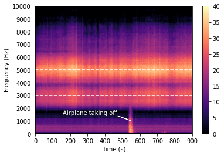
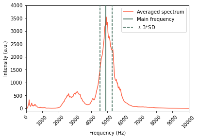
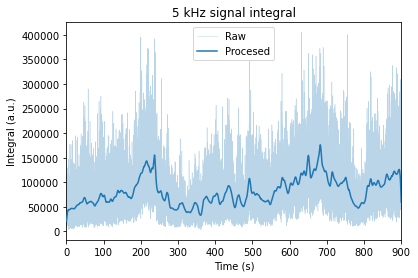
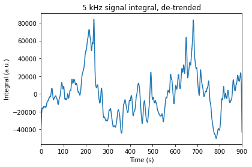
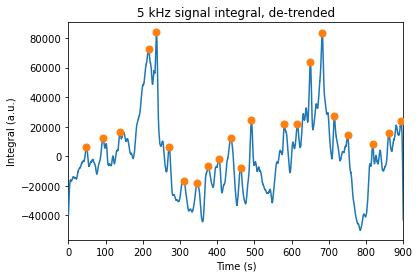
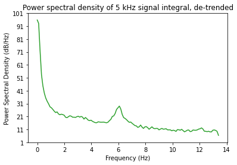
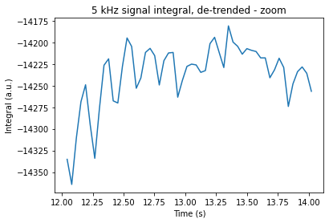

## TL;DR

I recorded the sound of cicadas during my holidays in order to analyze the periodic patterns in their song. Interestingly, I found a possible specie match -- *Cicada orni* -- based on song frequencies and modulation. 

---

## The song of the cicada

[Cicadas](https://en.wikipedia.org/wiki/Cicada) are very loud insects endemic in the Mediterranean basin. The males make vibrate an exoskeleton structure called tymbal to generate a calling *song* that can be as loud as 120 dB (!). 

The songs' notes and structure is often characteristic of a given species. Here is an example of a cicada singing recorded in Corfu, Greece:



Cicadas are most active during summer days, so the choir of thousands of males is a constant background all day long if you are anywhere near green areas. Here is an example from Evia, also in Greece:  



## A data scientist on holidays

During a wonderful holiday time in Kefalonia accompanied by the songs of the cicadas, I first grew curious about the frequencies present, so I used [phyphox](https://phyphox.org/) to check the spectrogram and saw a main frequency around 5 kHz. That satisfied curiosity for a while, but then I realized that the amplitude of the noise -- the *loudness* -- was also modulated: often it would oscillate for a while, then at times the chorus would rise to a *crescendo* and then suddenly drop. 

So I decided to record a sample and analyze the data back at home. Now here are the results of my little experiment. 

## The experiment

### Data

I recorded a ~18 minute audio with my phone from our hotel terrace, in front of a noisy backyard full of cicadas. You can download it from [here](./2022-08-06_1611.mp3). 



For the analysis, I discarded the first 30 seconds while I set up the phone and took the next 15 minutes.

### Results

I used [`pydub`](http://pydub.com/) to load, play and export the mp3 audio and `numpy` and `scipy` for processing. I also learned that `matplotlib` comes with a number of handy processing+plotting functions.

What follows is an excerpt from the Jupyter notebook I used for the analysis, which you can see [in the Github repository](https://github.com/miguelarbesu/cicada-songs/blob/main/notebooks/0-finding-periodicity.ipynb). 

#### Exploratory spectrogram

An initial look at the data using `matplolib`'s spectrogram (i.e. rolling Fourier Transform) reveals the frequency components in the audio. A Hamming window is used for smoothing. The spectrum was empty > 10 kHz - 20 kHz, so the range in the figure is set to 0-10000 Hz. The spectral resolution with 2048 point chunks is 23.4 Hz/point.
    

We see a continuous and broad maximum centered around 5 $\pm$ 1 kHz and a secondary maximum at ~3 $\pm$ 1 kHz. There is no apparent drift in frequency. Some kind of modulation of both signals is already appreciable in the form of vertical patterns. We are looking at the song of the cicadas!

There is a faint low frequency band > 1 kHz that suddenly spikes and stretches up to 2 kHz at ~520 seconds: it is an airplane taking of from the nearby airport, at around 10 km. Fortunately, it seems that the main cicada frequency at 5 kHz is not affected by that interference, so the whole audio sample is used analyze the modulation of that main signal.

From the spectrogram array the average maximum frequency is 4921.9 $\pm$ 120.4 Hz standard deviations. Now that we identified the position and variability of the main signal, we plot it over the averaged spectrum of the audio sample.

#### Data processing

In order to reduce noise and ensure we are always catching the bulk of the signal of interest, I will integrate the are between $\pm 3$ standard deviations around the mean maximum and process its evolution with a smaller Hamming window to retain more detail.  So, I will end with the time evolution of the loudness of the cicada's main tone. 

We see how the windowing does a good job at de-noising the trajectory of the integrated signal. Still, a slight monotonic increase becomes now evident, which obscures the periodic oscillations. I use a simple linear regression to de-trend the signal integral.

So there it is, the pattern I was curious about! It seems that cicadas go really loud and suddenly quiet every ~500 seconds, with some rhythmic variations in between. Let's simply put that in numbers by the distances between maxima.

The median peak distance is 35 s , which corresponds to a frequency of 0.029 Hz. The distance between the two tallest peaks is 446 s (7 min 23 seconds), corresponding to a 0.002 Hz modulation.

In a simple approximation I know now that the whole ensemble of cicadas around me (maybe thousands of them) was singing moderately up and down with a period of **~35 seconds**. Every **~7 minutes**, they would go really loud for about a minute to suddenly go quieter and start over.

Finally, the former NMR spectroscopist in me wanted to do another Fourier Transform and see the frequencies present in this loudness modulation. Although these were near zero and not nicely resolved, the spectrum brought another interesting feature.

    
The two modulations commented before peak very close to zero and resolution is not enough to distinguish them. However there is another weaker signal centered around 6 Hz in the PSD plot. This modulation was not evident when analyzing the whole 15 minutes of the integrated signal, but let's zoom in the seconds timescale.

    
There it is! I think this corresponds to the constant rhythm of the cicada's chirping, because it matches the order of magnitude -- i.e. a few chirps per second.

## Conclusions

I have analyzed a 15 minutes audio of a cicada chorus -- i.e. many cicadas singing simultaneously -- recorded in soutwest Kefalonia. In the spectrogram I find a characteristic **5 kHz main frequency with a weaker 3 kHz side band**. After processing the evolution of the 5 Khz signal intensity over time two low frequency modulations of the intensity appear, one with **short period of ~35 seconds and a longer one, also larger in amplitude, every ~7 minutes**. Of course these are just approximations since I only used one audio sample -- and for the longer period there is only one complete cycle.

In addition, there is a higher frequency modulation of the intensity at 6 Hz that could correspond to the chirping frequency of the individual cicadas. 

These features -- the characteristic 5 and 3 kHz frequencies and the 6 Hz modulation -- actually match an enthomological report from the area. Here are the spectrogram and oscillogram of the song of *Cicada orni* from [Trilar et al. 2020](http://dx.doi.org/10.15298/rusentj.29.1.03):

: spectrogram of the calling song; oscillogram of the enlarged part (section B) of the calling song")

We can see that the main frequency for this species also sits at 5 kHz with a sideband around 3 kHz. Also, the zoom in of the oscillogram shows a period of about 6 chirps per second, which matches the 6 Hz intensity modulation I observed. 

So it seems that it was mostly *Cicada orni* that were musicalizing my holidays!