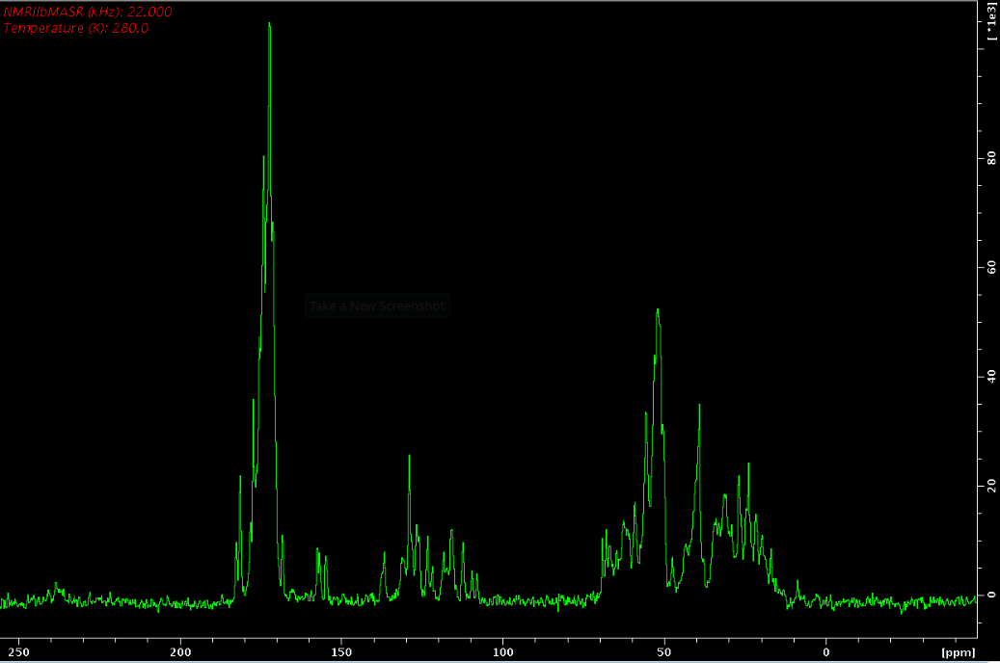
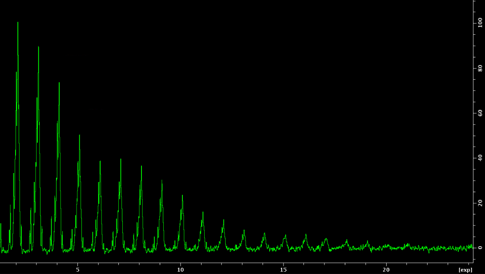

## What is Cross Polarization & why you want to do it?

[Cross
Polarization](https://en.wikipedia.org/wiki/Proton-enhanced_nuclear_induction_spectroscopy)
(**CP**) is a basic tool in solid state NMR first described by [Hartmann &
Hahn](https://journals.aps.org/pr/abstract/10.1103/PhysRev.128.2042) in 1962. In
essence, we apply two simultaneous radiofrequency (**RF**) pulses to transfer
magnetization from one nucleus to another. When the right frequencies (in the range of
kiloHertz, **kHz**) are used, the respective nuclear resonances *match* and the transfer
occurs under a so-called **Hartmann-Hahn condition**. One reason to do this is to boost
the signal of an *insensitive* type of nucleus (e.g. $^{13}C$) by transferring the
magnetization from a more polarizable one (e.g. $^{1}H$).

The 1-dimensional $^{1}H-^{13}C$ CP experiment is a common starting point for
protein structure investigations with solid state NMR. It looks like this for a small
[model protein](https://www.rcsb.org/structure/1M8M):



In this spectrum, we detect $^{13}C$ magnetization initially transferred from nearby $^{1}H$ via CP. The more efficient the CP step the stronger the signal, which for
example enables shorter experiment times.

In the case here I wanted to maximize the *backbone carbonyl* signals, that's the sharp
peaks on the left side, around 175 ppm.

## How do you do cross polarization?

In solid state NMR we usually rotate our sample *very fast*, at tens thousands of times
per second (kHz again). This is called Magic Angle Spinning (**MAS**), and makes the
**Hartmann-Hahn conditions multiple and periodic**, so there are several possible pairs
of RF frequencies to choose from. 

In practice you spin up you sample, set the RF values to a known CP condition and then,
because of experimental variability, you fine tune them. Topspin, the *de facto* only
program for acquisition of NMR experiments, has a routine called `popt` to fix one RF
and vary the other stepwise $n$ times over a given range. In the example, a 1D
spectrum is acquired at each $^{1}H$ RF:

 *Array of 1D $^{1}H-^{13}C$ CP spectra with varying $^{1}H$ RF. The x axis here represents
the number of experiments, not the RF frequency*.

This example illustrates the periodicity of the CP conditions, with multiple local
maxima. 

## Mapping the Hartmann-Hahn conditions

A one parameter optimization is often enough to get a good CP condition, but
sometimes you need to be more exhaustive. You may not be sure which condition will be
best, so you can do a **2-parameter optimization** on both RF pulses. 

This is handled by Topspin as a recursive `popt` over a new array of $m$ steps. The
implementation is a bit weird, so you end up with a 1D $m*n$ array of spectra indexed
by the experiment number for each $^{1}H$, $^{13}C$ RF pair. The best pair of
parameter values is recorded in the end according to the maximum integral or intensity
fo the signal. 


This representation of the data has two problems. First, the concatenated array does not
display the second dimension intuitively. Secondly, the experiment number in the x axis
does not give a quick idea of the respective RF values. The underlying structure of the
data is totally obfuscated. 

### A heat map works best here

An obvious choice for representing an intensity that depends on two parameters is a heat
map. Python's [Seaborn](https://seaborn.pydata.org/) has nice heat maps that work
seamlessly with [Pandas](https://pandas.pydata.org/), which can easily parse Topspin's
`popt` results file (by default `popt.protocol.999`) to tabular format. The file contains the respective values of the RF pulses, and the maximum, minimum and integral of the signal in each experiment. The integral is our value of interest here.

```python
import pandas as pd
import seaborn as sns

# Parse popt array data with pandas
popt = pd.read_csv(filepath_or_buffer="../data/expfolder/expno/popt.protocol.999",
                   skiprows=24, 
                   skipinitialspace=True, 
                   skipfooter=3, 
                   sep="\s+", 
                   engine="python", 
                   index_col=0, 
                   names=["1H RF", 
                          "13C RF",
                          "max",
                          "min",
                          "integral"])

# Normalize integral values
popt["integral"] = popt["integral"]/popt["integral"].mean()
# Re-shape array for Seaborn
poptarray = popt.pivot(index="1H RF",
                       columns=["13C RF"],
                       values="integral")

# Plot with Seaborn
ax = sns.heatmap(poptarray, 
                 cmap="icefire",
                 xticklabels=2,
                 yticklabels=2,
                 center=0)
ax.invert_yaxis()
ax.set_aspect(1)
ax.set_title("MAS = 22 kHz");

```


This approach gives a clear-cut representation of the Hartmann-Hahn condition landscape.
One can immediately see the periodicity imposed by the MAS frequency in the distance
between maxima (22 kHz in this example). The intensities of the different maxima can be
readily compared. Moreover, the existence of different kinds of CP, one giving a
positive signal and the other negative, becomes evident. In this case, this helped me
find a CP condition (54 & 42 kHZ) which gave a very efficient transfer in a lower power
range than I initially anticipated (~ 75 kHz for $^{1}H$).