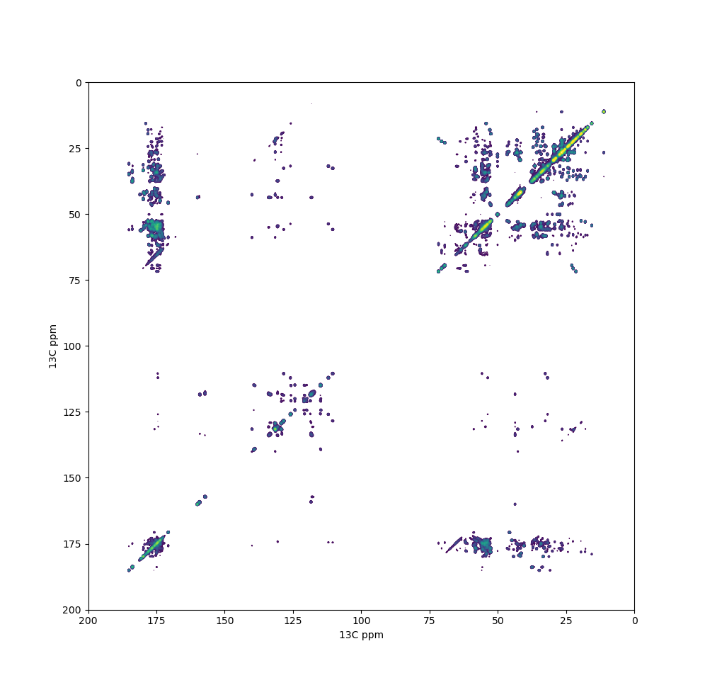
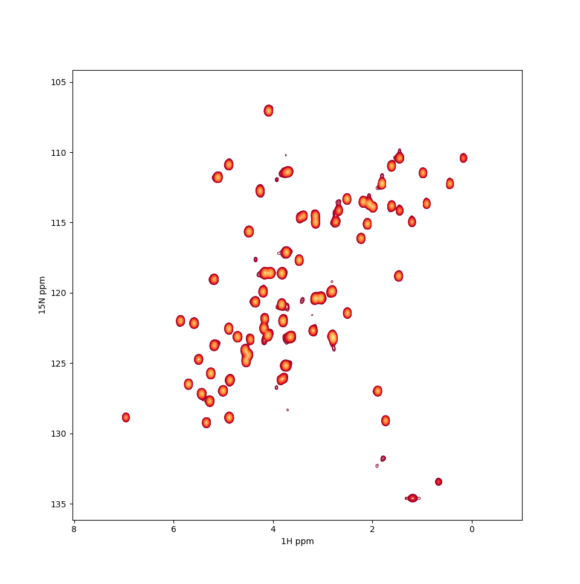

## TL;DR

`nmrplot` is a wrapper around `nmrglue` for plotting NMR spectra using
`matplotlib`. It is also the first *proper* Python package I make using my own
Cookiecutter template with testing, linting, CI, and documentation building.

## Motivation

During the last couple of years I have been making extensive use of
[`nmrglue`](https://nmrglue.readthedocs.io/) for loading NMR spectra into Jupyter
notebooks and preparing figures for presentations and reports. 

`nmrglue` is a great tool for all NMR & Python aficionados: it can read, process and
write NMR spectra in most formats. Used with `matplotlib`, the resulting contour plots
are not only nicer than the standard exports from NMR-specific software, but also **scriptable**.


*Example of a $^{13}C$-$^{13}C$ MAS NMR spectrum of model protein SH3 using nmrplot in CLI mode*

After consistently using a hacky code-dump module in different NMR research projects,
I thought this would be a good opportunity to start a small Python project.

In parallel, I had also been learning some best practices in software development and
distribution. My use of version control, documentation and linting was quite lax, and I
had never implemented continuous integration. So after some research I put all these
parts in a [custom
cookiecutter](https://miguelarbesu.github.io/cookiecutter-reproducible-science/) (post
to come about that) and started the [`nmrplot`
project](https://miguelarbesu.github.io/nmrplot). 

## Goal

The goal of this tool is generating **high quality, information-rich figures directly
from processed NMR data**. Additional data layers calculated on the fly can be easily
implemented. Examples of such additional information include peak analysis — picking,
integration, probabilistic assignment —, spectral analysis — signal-to-noise,
referencing — or comparison between spectra.

`nmrplot` is limited to 1D and 2D spectra (or 2D slices of >= 3D spectra). 
Support for other formats than Bruker — NMRPipe, Varian — should be
straightforward, as this is already possible in `nmrglue` . I guess that is a good
opportunity to learn how to use [decorators](https://realpython.com/primer-on-python-decorators/).

## Description and use cases

`nmrplot` is a module with a Command Line Interface (CLI) for direct interaction. The
CLI provides basic plotting capabilities from the terminal, while the `Spectrum` class
permits deeper interaction.

### Usage from the command line

The CLI is intended to provide quick visualization while navigating a data set. The default parameters are set so running

```bash
nmrplot EXPERIMENT_PATH/EXPNO
```

should give a reasonably good contour plot. The default matplotlib QT backend enables panning, zooming and saving in various formats, among other basic options.

Plotting parameters can be easily tuned by passing options described in the help menu:

```bash
nmrplot --help

Usage: nmrplot [OPTIONS] PATH

  Plot a 1D or 2D Bruker NMR spectrum in a given path

Options:
  -p, --pdata TEXT       Number of processing in the Bruker experiment
  -t, --threshold FLOAT  How many times the noise level is the lowest contour
                         above the baseline
  -c, --cmap TEXT        The colormap to use. Options are: viridis, red, blue,
                         green, purple, orange, grey, light_red, light_blue.
                         Only with sign=both: coolwarm
  -n, --nlevs INTEGER    Number of contour levels to draw
  -f, --factor FLOAT     Increment factor between contour levels
  -s, --sign TEXT        Whether to draw positive, negative or both contours.
                         Options are: positive, negative, both
  --help                 Show this message and exit.

```

I used [`click`](https://click.palletsprojects.com) to generate this CLI. It is a very
convenient tool, as all the help interface is automatically generated from the
[`__main__.py`](https://github.com/miguelarbesu/nmrplot/blob/main/src/nmrplot/__main__.py).
This, along with the online documentation — also automatically parsed by [`mkdocstrings`](https://mkdocstrings.github.io/) — provides the user with complete and handy information with little effort. 


### Usage in Jupyter notebooks and Python scripts

I find Jupyter notebooks are great environments for making figures and plots for papers
and reports, from the initial exploratory stage to the publication stage. Plain scripts
can provide the same functionality and are less conflictive with version control, so
they are probably a better solution for long-term deposition. 

[Here](https://github.com/miguelarbesu/nmrplot/blob/main/notebooks/example.ipynb) is a notebook with an example plot using the `Spectrum.plot_spectrum` method, but one can also directly access `Spectrum.data`.

## Advantages of `nmrplot`

### Traceability and reproducibility

A notebook or script containing the paths to the data inputs and the figure outputs is a
traceable and self-contained solution, perfect for scientific communications. Raw data, processed outputs and analysis can be easily shared with collaborators or made public.  

As a task gets more complex than simple on-the-fly analysis, refactoring the code in a
separate module and adding environment requirements and dependencies also enforces
reproducibility.

### Composability

[`matplotlib`](https://matplotlib.org/) is the *de facto* standard Python library for
plotting. It will get the job done for users of any level in most cases, so with a few
visits to [Stackoverflow](www.stackoverflow.com), one can compose complex publication
figures with multiple subplots, insets, etc. 

There also tools in the Python environment that enable interactive plots, like
[`bokeh`](https://docs.bokeh.org/en/latest/index.html) or
[`plotly`](https://plotly.com/). Such format can be interesting for academic researchers
in the context of collaboration of dissemination.

### Beautiful plots

Most specialized NMR data analysis software I know lack love on the aesthetical side.
Nice modern color maps, fonts, alpha compositing, contour level thickness ar little
things that can make the difference between a dull plot and a pleasing figure for your
presentations and papers.


*Example of a $^{1}H$-$^{15}N$ solution NMR spectrum of model protein SH3 using nmrplot in CLI mode*


Also, exporting options are totally customizable: format, size, resolution... Write the
settings once, update all figures whenever you want!

## How to install nmrplot

`nmrplot` can be installed using pip from the command line directly from GitHub:

```bash
python -m pip install git+https://github.com/miguelarbesu/nmrplot  
```

Insiders can install an editable dev copy by cloning or forking the repository and running 

```bash
python -m pip install -e .
```
